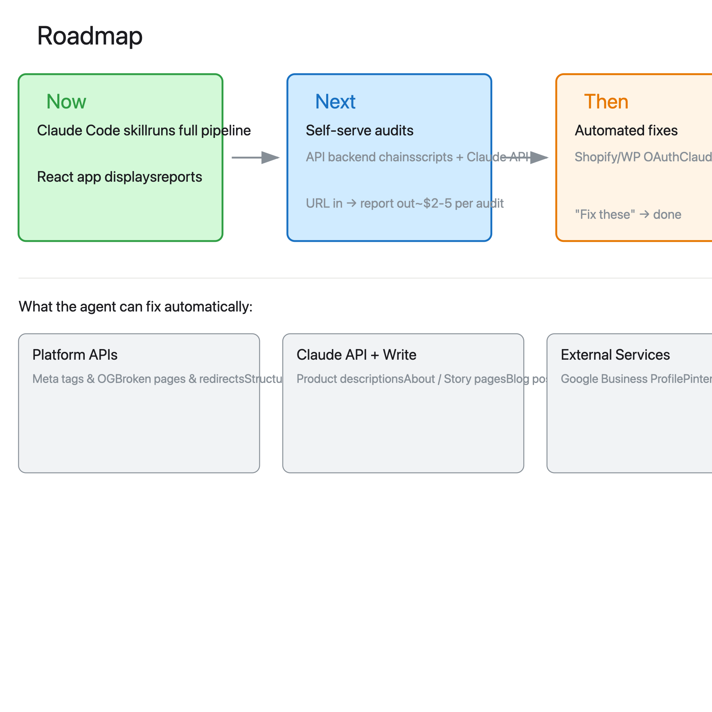

# Brand Audit Tool

Automated brand and online presence audits for small businesses. You give it a URL, it researches everything a prospective customer would find online, scores every category, and produces a report that looks like it came from a consultancy.

Each audit used to take around four hours of manual research. This brings it down to about thirty minutes of review.


---

## Live Reports

| Business | What They Do | Report |
|----------|-------------|--------|
| Willow Leather | Handmade leather goods, solo maker | [willow-leather-audit.vercel.app](https://willow-leather-audit.vercel.app) |
| Bureau Bonanza | Design studio, Dublin/London | [bureau-bonanza-audit.vercel.app](https://bureau-bonanza-audit.vercel.app) |
| Near Mint | Vinyl record cleaning + record fairs | [near-mint-audit.vercel.app](https://near-mint-audit.vercel.app) |
| c/o Lampa | Luxury interior architecture | [colampa-audit.vercel.app](https://colampa-audit.vercel.app) |

---

## Roadmap



The audit becomes the sales tool. The implementation becomes the product. A business owner reads the report, clicks "fix these", and an agent does the work that would normally cost £500-2000 and take weeks.

---

## How to Use It

**Claude Code Skill** - install the skill, run audits from the terminal:

```
/brand-audit discover https://example.com
/brand-audit draft example-business
/brand-audit deploy example-business
```

**React App** - browser dashboard for viewing and managing audits. Import JSON, browse reports with the same editorial design. localStorage, no backend.
