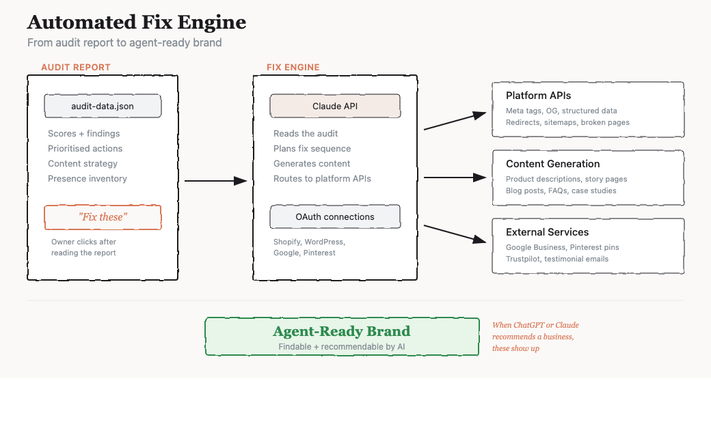

# Brand Audit Tool

Automated brand and online presence audits for small businesses - built for a world where AI agents are the new search engines.

You give it a URL. It researches everything a prospective customer would find online, scores every category, and produces a report that looks like it came from a consultancy. Then it helps fix what's broken - not just for Google, but for the ChatGPTs and Claudes that are increasingly where people start when they're looking for a product, a service, or a recommendation.

Most small businesses are invisible to AI. Their product pages are thin, their metadata is missing, their story isn't written down anywhere an LLM can find it. This tool audits that gap and closes it.


---

## Live Reports

| Business | What They Do | Report |
|----------|-------------|--------|
| Willow Leather | Handmade leather goods, solo maker | [willow-leather-audit.vercel.app](https://willow-leather-audit.vercel.app) |
| Bureau Bonanza | Design studio, Dublin/London | [bureau-bonanza-audit.vercel.app](https://bureau-bonanza-audit.vercel.app) |
| Near Mint | Vinyl record cleaning + record fairs | [near-mint-audit.vercel.app](https://near-mint-audit.vercel.app) |
| c/o Lampa | Luxury interior architecture | [colampa-audit.vercel.app](https://colampa-audit.vercel.app) |

---

## Roadmap

**Now** — Claude Code skill runs the full pipeline. React app displays reports.

**Next: Self-serve audits** — API backend that chains the scripts and Claude API. User enters a URL, gets a report back in 10-15 minutes. ~$2-5 in API cost per audit.

**Then: Automated fixes** — The audit tells you what's wrong. This step fixes it. A business owner reads the report, clicks "fix these", and a Claude agent does the work — rewriting product descriptions, fixing meta tags, setting up Google Business, submitting sitemaps. The stuff that normally costs £500-2000 and takes weeks.



The end goal is agent-ready brands. When someone asks ChatGPT to find a leather bag maker in the UK or asks Claude for a design studio in Dublin, the businesses we've audited and fixed actually show up — with enough context to be recommended. That's the new SEO.

---

## How to Use It

**Claude Code Skill** — install the skill, run audits from the terminal:

```
/brand-audit discover https://example.com
/brand-audit draft example-business
/brand-audit deploy example-business
```

**React App** — browser dashboard for viewing and managing audits. Import JSON, browse reports with the same editorial design. localStorage, no backend.
