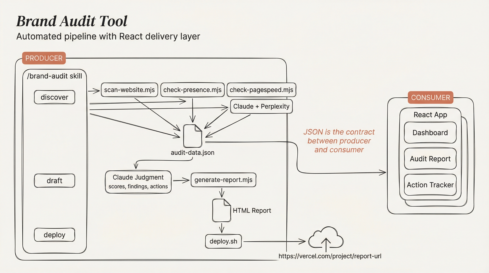

# Brand Audit Tool

Automated brand and online presence audits for small businesses. You give it a URL, it researches everything a prospective customer would find online, scores every category, and produces a report that looks like it came from a consultancy.

Each audit used to take around four hours of manual research. This brings it down to about thirty minutes of review.



---

## Live Reports

| Business | What They Do | Report |
|----------|-------------|--------|
| Willow Leather | Handmade leather goods, solo maker | [willow-leather-audit.vercel.app](https://willow-leather-audit.vercel.app) |
| Bureau Bonanza | Design studio, Dublin/London | [bureau-bonanza-audit.vercel.app](https://bureau-bonanza-audit.vercel.app) |
| Near Mint | Vinyl record cleaning + record fairs | [near-mint-audit.vercel.app](https://near-mint-audit.vercel.app) |
| c/o Lampa | Luxury interior architecture | [colampa-audit.vercel.app](https://colampa-audit.vercel.app) |

---

## The Pipeline

```
discover                          draft                        deploy
--------                          -----                        ------
+------------------+              +-------------------+        +----------+
| scan-website.mjs |--+           | Claude judgment   |        | deploy.sh|
| check-presence   |--+-> JSON -> | scores, findings  |-> HTML->| Vercel   |
| check-pagespeed  |--+           | actions, summary  |        | live URL |
| Claude+Perplexity|--+           | generate-report   |        +----------+
+------------------+              +-------------------+
```

Scripts handle deterministic work (HTML parsing, API calls, HTTP checks). Claude handles everything that needs judgment - scoring, writing, prioritisation, and research on platforms that block scripts. Everything flows through a single `audit-data.json` file. All scripts use zero external dependencies.

---

## Two Ways to Use It

**Claude Code Skill** - install the skill, run audits from the terminal:

```
/brand-audit discover https://example.com
/brand-audit draft example-business
/brand-audit deploy example-business
```

**React App** - browser dashboard for viewing and managing audits. Import JSON, browse reports with the same editorial design, create new audits. localStorage, no backend.

---

## Writing Rules

Orwell's rules. No marketing jargon. Write for the business owner, not a marketer. Plain English. Short sentences. Be direct about problems. Acknowledge what's genuinely good first.

---

## Roadmap

**Now** - Claude Code skill runs the full pipeline. React app displays reports.

**Next: Self-serve audits** - API backend that chains the scripts and Claude API together. User enters a URL, gets a report back in 10-15 minutes. No Claude Code required. ~$2-5 in API cost per audit.

**Then: Automated fixes** - The audit tells you what's wrong. This step fixes it. Connect Shopify/WordPress OAuth and a Claude agent can action the quick wins directly:

| What | How |
|------|-----|
| Fix meta descriptions, titles, OG tags | Shopify/WordPress API |
| Rewrite product descriptions for SEO | Claude API + platform write access |
| Add structured data / JSON-LD | Inject via theme or API |
| Fix broken pages, redirects | Platform API |
| Write "Our Story", process pages, case studies | Claude API + draft for approval |
| Set up Google Business Profile | Google Business API |
| Create Pinterest business account, pin products | Pinterest API |
| Draft blog posts (care guides, how-tos) | Claude API |
| Submit sitemap to Search Console | Google API |
| Collect testimonials (draft the ask email) | Claude API + email integration |

The audit becomes the sales tool. The implementation becomes the product. A business owner reads the report, clicks "fix these", and an agent does the work that would normally cost £500-2000 and take weeks.
